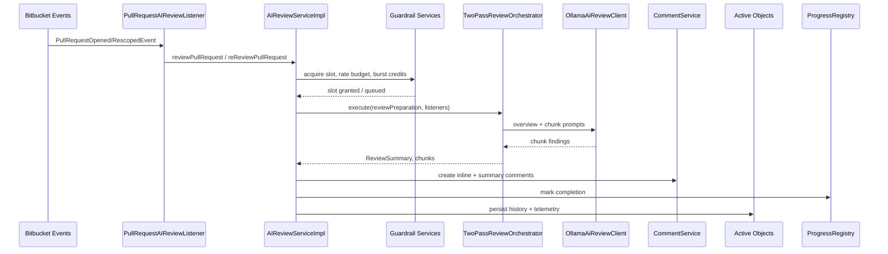

# AI Code Reviewer for Bitbucket – Architecture

## High-Level Architecture
The plugin is a Bitbucket Data Center app built with Atlassian Spring Scanner and Maven. Runtime components fall into three layers:

1. **Integration layer (`com.teknolojikpanda.bitbucket.aireviewer`)** — subscribes to Bitbucket events, exposes REST endpoints and servlets, registers merge checks, manages guardrails, and persists data through Active Objects.【F:src/main/java/com/teknolojikpanda/bitbucket/aireviewer/listener/PullRequestAIReviewListener.java†L23-L158】【F:src/main/resources/atlassian-plugin.xml†L11-L353】
2. **AI orchestration core (`com.teknolojikpanda.bitbucket.aicode`)** — converts Bitbucket diffs into AI-friendly prompts, orchestrates two-pass reviews, caches overviews, and integrates with Ollama-compatible models.【F:src/main/java/com/teknolojikpanda/bitbucket/aicode/core/TwoPassReviewOrchestrator.java†L24-L147】【F:src/main/java/com/teknolojikpanda/bitbucket/aicode/core/OllamaAiReviewClient.java†L24-L220】
3. **UI resources (`src/main/resources`)** — Velocity templates and AUI web-resources powering admin consoles, progress panels, and client-side polling scripts.【F:src/main/resources/atlassian-plugin.xml†L226-L353】

`atlassian-plugin.xml` registers Active Objects entities, REST modules, servlets, repository merge checks, and web resources. Spring Scanner annotations expose services (`AIReviewService`, `GuardrailsTelemetryService`, etc.) for dependency injection across layers.【F:src/main/resources/atlassian-plugin.xml†L14-L320】【F:src/main/java/com/teknolojikpanda/bitbucket/aireviewer/service/AIReviewServiceImpl.java†L61-L157】

### Deployment topology
- The plugin runs inside each Bitbucket application node. Guardrail state and review history persist in Active Objects tables stored in the shared database.【F:src/main/java/com/teknolojikpanda/bitbucket/aireviewer/ao/AIReviewHistory.java†L1-L200】
- Worker pools and guardrail metrics are per-node; scheduler coordination uses the Atlassian Scheduler backed by the shared database to avoid duplicate jobs.【F:src/main/java/com/teknolojikpanda/bitbucket/aireviewer/service/ReviewWorkerPool.java†L1-L200】【F:src/main/java/com/teknolojikpanda/bitbucket/aireviewer/service/ReviewHistoryCleanupScheduler.java†L1-L155】
- REST resources, servlets, and PR panels are accessible on every node; progress state is cached in-memory per node via `ProgressRegistry` and reconciled with persisted history for resilience.【F:src/main/java/com/teknolojikpanda/bitbucket/aireviewer/progress/ProgressRegistry.java†L17-L177】

## Core Flows / Behavior
### Automatic pull request review

1. `PullRequestAIReviewListener` evaluates configuration (enabled flag, draft policy, rollout cohort) before dispatching to `AIReviewService`. It executes within Bitbucket’s security context to ensure permission checks succeed.【F:src/main/java/com/teknolojikpanda/bitbucket/aireviewer/listener/PullRequestAIReviewListener.java†L40-L158】
2. `AIReviewServiceImpl` snapshots configuration, enforces concurrency and rate limits (`ReviewConcurrencyController`, `ReviewRateLimiter`, `GuardrailsBurstCreditService`), prepares diffs via `DefaultDiffProvider`, and creates chunk plans through `HeuristicChunkPlanner`.【F:src/main/java/com/teknolojikpanda/bitbucket/aireviewer/service/AIReviewServiceImpl.java†L190-L350】【F:src/main/java/com/teknolojikpanda/bitbucket/aireviewer/service/ReviewRateLimiter.java†L1-L200】
3. `TwoPassReviewOrchestrator` runs an overview pass followed by parallel chunk passes, leveraging the `ReviewWorkerPool` for concurrency. Chunk lifecycle events update `ProgressRegistry` for UI polling.【F:src/main/java/com/teknolojikpanda/bitbucket/aicode/core/TwoPassReviewOrchestrator.java†L24-L147】【F:src/main/java/com/teknolojikpanda/bitbucket/aireviewer/service/ReviewWorkerPool.java†L1-L200】
4. `OllamaAiReviewClient` formats prompts, calls the Ollama API with retries, applies fallback model logic, and transforms responses into domain objects (`ReviewFinding`, `ReviewSummary`).【F:src/main/java/com/teknolojikpanda/bitbucket/aicode/core/OllamaAiReviewClient.java†L24-L220】
5. `AIReviewServiceImpl` maps findings to diff anchors, posts comments using `CommentService`, and persists `AIReviewHistory`/`AIReviewChunk` entities alongside queue audit entries. Progress entries are cleared and the merge check is signalled.【F:src/main/java/com/teknolojikpanda/bitbucket/aireviewer/service/AIReviewServiceImpl.java†L351-L520】【F:src/main/java/com/teknolojikpanda/bitbucket/aireviewer/ao/AIReviewChunk.java†L1-L200】

### Manual review trigger flow
- `ManualReviewResource` validates administrator permissions, resolves the target repository/PR, and calls `manualReview` or `forceReview` on `AIReviewService`. Forced runs bypass incremental diffing but still consume guardrail slots.【F:src/main/java/com/teknolojikpanda/bitbucket/aireviewer/rest/ManualReviewResource.java†L25-L132】
- Operations UI actions hit REST endpoints to pause/resume schedulers, purge queues, or grant burst credits. These actions record entries in `AIReviewQueueAudit` for traceability.【F:src/main/java/com/teknolojikpanda/bitbucket/aireviewer/servlet/ReviewOperationsServlet.java†L80-L160】【F:src/main/java/com/teknolojikpanda/bitbucket/aireviewer/ao/AIReviewQueueAudit.java†L1-L200】

### Guardrails telemetry & alerting
- `GuardrailsTelemetryService` aggregates queue depth, limiter consumption, worker heartbeats, and incident trends for the Health dashboard and REST metrics.【F:src/main/java/com/teknolojikpanda/bitbucket/aireviewer/service/GuardrailsTelemetryService.java†L1-L200】
- `GuardrailsAlertingService` evaluates telemetry snapshots against configured thresholds. Breaches create `GuardrailsRateIncident` entities, notify alert channels, and may auto-snooze limits for priority repositories via `GuardrailsAutoSnoozeService`.【F:src/main/java/com/teknolojikpanda/bitbucket/aireviewer/service/GuardrailsAlertingService.java†L1-L200】【F:src/main/java/com/teknolojikpanda/bitbucket/aireviewer/ao/GuardrailsRateIncident.java†L1-L200】
- `ModelHealthProbeScheduler` periodically probes configured AI models; degraded probes flag the Health dashboard and can trigger automatic fallback-model promotion until stability returns.【F:src/main/java/com/teknolojikpanda/bitbucket/aireviewer/service/ModelHealthProbeScheduler.java†L1-L200】【F:src/main/java/com/teknolojikpanda/bitbucket/aireviewer/service/ModelHealthService.java†L1-L200】

### History retention & maintenance
- `ReviewHistoryCleanupScheduler` registers a scheduled job once plugin lifecycle starts. It reads cleanup cadence from `ReviewHistoryCleanupStatusService`, deletes expired histories/chunks in batches via `ReviewHistoryMaintenanceService`, and logs audit results in `AIReviewCleanupAudit`.【F:src/main/java/com/teknolojikpanda/bitbucket/aireviewer/service/ReviewHistoryCleanupScheduler.java†L1-L155】【F:src/main/java/com/teknolojikpanda/bitbucket/aireviewer/service/ReviewHistoryMaintenanceService.java†L1-L200】

## Data Model
Active Objects entities capture durable state. Key tables and relationships include:

- **`AIReviewConfiguration`** — singleton global configuration storing API endpoints, model choices, severity settings, guardrail thresholds, and operational toggles.【F:src/main/java/com/teknolojikpanda/bitbucket/aireviewer/ao/AIReviewConfiguration.java†L18-L185】
- **`AIReviewRepoConfiguration`** — per-project or per-repository overrides referencing project/repository IDs, rollout cohorts, and priority flags. Rows link implicitly to Bitbucket repositories via IDs stored in columns; the plugin resolves them through Bitbucket services.【F:src/main/java/com/teknolojikpanda/bitbucket/aireviewer/ao/AIReviewRepoConfiguration.java†L1-L200】
- **`AIReviewHistory`** ←→ **`AIReviewChunk`** — parent-child relationship capturing review runs and chunk-level telemetry (duration, tokens, findings JSON). Chunks reference histories via foreign keys, enabling detailed drill-down in the History UI.【F:src/main/java/com/teknolojikpanda/bitbucket/aireviewer/ao/AIReviewHistory.java†L1-L200】【F:src/main/java/com/teknolojikpanda/bitbucket/aireviewer/ao/AIReviewChunk.java†L1-L200】
- **Queue & scheduler entities** — `AIReviewSchedulerState` stores pause/resume flags; `AIReviewQueueAudit` records manual overrides; `AIReviewCleanupStatus`/`AIReviewCleanupAudit` track retention jobs.【F:src/main/java/com/teknolojikpanda/bitbucket/aireviewer/ao/AIReviewSchedulerState.java†L1-L200】【F:src/main/java/com/teknolojikpanda/bitbucket/aireviewer/ao/AIReviewCleanupAudit.java†L1-L200】
- **Guardrail entities** — `GuardrailsRateBucket`, `GuardrailsRateIncident`, `GuardrailsRateOverride`, `GuardrailsBurstCredit`, `GuardrailsWorkerNodeState`, and `AIReviewRolloutCohort` store limiter windows, incident history, override metadata, available burst credits, per-node worker stats, and phased rollout membership.【F:src/main/java/com/teknolojikpanda/bitbucket/aireviewer/ao/GuardrailsRateBucket.java†L1-L200】【F:src/main/java/com/teknolojikpanda/bitbucket/aireviewer/ao/GuardrailsWorkerNodeState.java†L1-L200】
- **Alerting channels** — `GuardrailsAlertChannel` and `GuardrailsAlertDelivery` persist alert destinations and delivery receipts for compliance evidence.【F:src/main/java/com/teknolojikpanda/bitbucket/aireviewer/ao/GuardrailsAlertChannel.java†L1-L200】

Transient data is held in-memory:
- `ProgressRegistry` tracks in-flight review status keyed by pull request ID for UI polling.【F:src/main/java/com/teknolojikpanda/bitbucket/aireviewer/progress/ProgressRegistry.java†L17-L177】
- `OverviewCache` stores generated overview prompts per commit to avoid redundant AI calls.【F:src/main/java/com/teknolojikpanda/bitbucket/aicode/core/OverviewCache.java†L1-L200】
- Worker pool state resides in `ReviewWorkerPool`, which cooperates with `WorkerDegradationService` to reduce concurrency when guardrails trigger degradation mode.【F:src/main/java/com/teknolojikpanda/bitbucket/aireviewer/service/WorkerDegradationService.java†L1-L200】

## Key Classes and Extension Points
- **Event Listener** — `PullRequestAIReviewListener` registers via Spring Scanner and Atlassian Event Publisher to handle PR open/rescope events.【F:src/main/java/com/teknolojikpanda/bitbucket/aireviewer/listener/PullRequestAIReviewListener.java†L23-L158】
- **Merge Check** — `AIReviewInProgressMergeCheck` implements `RepositoryMergeCheck` to veto merges while progress entries exist.【F:src/main/java/com/teknolojikpanda/bitbucket/aireviewer/hook/AIReviewInProgressMergeCheck.java†L18-L71】
- **REST Resources** — configuration (`ConfigResource`, `RepoConfigResource`), history (`HistoryResource`, `ManualReviewResource`), monitoring (`MonitoringResource`, `ProgressResource`, `MetricsResource`), automation (`AutomationResource`), and guardrail endpoints expose JSON APIs for admin consoles and integrations.【F:src/main/java/com/teknolojikpanda/bitbucket/aireviewer/rest/ConfigResource.java†L1-L200】
- **Servlets & Web Panels** — admin console servlets render Velocity templates loaded by web resources: `AdminConfigServlet`, `ReviewHistoryServlet`, `ReviewHealthServlet`, `ReviewOperationsServlet`. Front-end scripts poll REST endpoints and display AUI components.【F:src/main/resources/atlassian-plugin.xml†L226-L320】【F:src/main/java/com/teknolojikpanda/bitbucket/aireviewer/servlet/ReviewHealthServlet.java†L1-L140】
- **Schedulers** — `ReviewHistoryCleanupScheduler`, `ModelHealthProbeScheduler`, `GuardrailsAlertingScheduler`, `GuardrailsWorkerHeartbeatScheduler` (implied by services) run recurring tasks through Atlassian Scheduler.【F:src/main/java/com/teknolojikpanda/bitbucket/aireviewer/service/ModelHealthProbeScheduler.java†L1-L200】【F:src/main/java/com/teknolojikpanda/bitbucket/aireviewer/service/ReviewHistoryCleanupScheduler.java†L1-L155】
- **Services & Utilities** — `AIReviewServiceImpl`, `AIReviewerConfigServiceImpl`, `ReviewHistoryService`, `GuardrailsTelemetryService`, `GuardrailsAlertingService`, `ReviewWorkerPool`, `ReviewSchedulerStateService`, `HttpClientUtil`. These are exported as Spring services and reused across listeners, REST resources, and jobs.【F:src/main/java/com/teknolojikpanda/bitbucket/aireviewer/service/AIReviewerConfigServiceImpl.java†L74-L184】【F:src/main/java/com/teknolojikpanda/bitbucket/aireviewer/util/HttpClientUtil.java†L1-L200】
- **AI Core Contracts** — `DiffProvider`, `ChunkPlanner`, `ChunkStrategy`, `AiReviewClient`, and `ReviewOrchestrator` interfaces enable pluggable diff strategies or model providers for future expansion.【F:src/main/java/com/teknolojikpanda/bitbucket/aicode/api/DiffProvider.java†L1-L200】

## Error Handling, Logging, and Security
- **Logging** — All components use SLF4J. Listeners and services log lifecycle events at INFO, guardrail warnings at WARN, and failures with stack traces at ERROR. AI integration logs include prompt identifiers and response metadata for traceability.【F:src/main/java/com/teknolojikpanda/bitbucket/aicode/core/OllamaAiReviewClient.java†L48-L173】【F:src/main/java/com/teknolojikpanda/bitbucket/aireviewer/listener/PullRequestAIReviewListener.java†L46-L123】
- **Error resilience** — `AIReviewServiceImpl` wraps chunk processing in try/catch blocks, promotes fallback models when primary models fail, and records failure metrics in history entities. Guardrails convert systemic failures into incidents and can pause new reviews until administrators intervene.【F:src/main/java/com/teknolojikpanda/bitbucket/aireviewer/service/AIReviewServiceImpl.java†L351-L520】【F:src/main/java/com/teknolojikpanda/bitbucket/aireviewer/service/GuardrailsAlertingService.java†L1-L200】
- **Scheduler robustness** — Scheduled jobs capture exceptions, persist audit entries, and reschedule themselves with exponential back-off recorded in `AIReviewCleanupStatus` to avoid repeated failures.【F:src/main/java/com/teknolojikpanda/bitbucket/aireviewer/service/ReviewHistoryCleanupScheduler.java†L75-L155】
- **Security & permissions** — REST resources and servlets enforce system-administrator checks through SAL `UserManager`/Bitbucket `PermissionService`. Review execution impersonates a service account via `SecurityService` to honor repository permissions and leave accurate audit trails.【F:src/main/java/com/teknolojikpanda/bitbucket/aireviewer/rest/ManualReviewResource.java†L44-L90】【F:src/main/java/com/teknolojikpanda/bitbucket/aireviewer/service/AIReviewServiceImpl.java†L109-L195】
- **Guardrail protections** — Concurrency slots, rate limiting, burst credits, worker degradation, and merge vetoes ensure the AI pipeline cannot overwhelm Bitbucket or leave PRs partially reviewed.【F:src/main/java/com/teknolojikpanda/bitbucket/aireviewer/service/ReviewConcurrencyController.java†L1-L200】【F:src/main/java/com/teknolojikpanda/bitbucket/aireviewer/hook/AIReviewInProgressMergeCheck.java†L18-L71】
