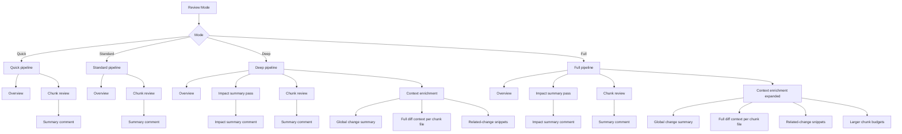

# Architecture

This document explains how AI Code Reviewer integrates with Bitbucket, how requests flow through the system, and which components store and process data.

## High-Level Overview

```
Pull Request Event --> PullRequestAIReviewListener
                           |
                           v
                   AIReviewServiceImpl
                     |    |      |
                     |    |      +--> ReviewHistoryService (Active Objects)
                     |    +--> TwoPassReviewOrchestrator (chunking + AI client)
                     v
             CommentService / ProgressRegistry / Guardrails
```

Key modules:

- **Listener** (`PullRequestAIReviewListener`) subscribes to `PullRequestOpenedEvent` and `PullRequestRescopedEvent`, filters by configuration, and invokes the review service.
- **Service layer** (`AIReviewServiceImpl`) coordinates diff retrieval, chunk planning, orchestration, comment posting, history persistence, guardrail enforcement, and progress tracking.
- **Review pipeline** (`TwoPassReviewOrchestrator`, `HeuristicChunkPlanner`, `OllamaAiReviewClient`) prepares prompts, splits diffs into manageable chunks, performs a two-stage model query (overview then chunks), and captures metrics.
- **Guardrails services** (rate limiting, queue control, worker degradation, burst credits, rollout cohorts) enforce safe concurrency and provide administrative overrides.
- **Active Objects entities** persist configuration snapshots, review history, cleanup audits, rollout cohorts, limiter incidents, alert channels, and worker state.
- **REST layer** exposes configuration, progress, automation, metrics, manual triggers, history browsing, and repository overrides under `/rest/ai-reviewer/1.0`.
- **Admin servlets** render the Configuration, History, Health, and Operations pages using Velocity templates and bundled web resources.

## Core Flows

### Review Modes (Quick/Standard/Deep/Full)

Review modes control how much context the model sees and how aggressively it scans for issues. They layer on top of the base two-pass pipeline and tune chunking limits, profiles, and extra context stages.

#### Quick

- **Goal**: Fast feedback on critical/high risks with minimal cost.
- **Context inputs**:
        - Overview summary
        - Chunk diff only
- **Chunking**: Smaller chunk budgets to prioritize speed.
- **Profile defaults**: Lightweight thresholds (higher min severity, fewer findings per file).
- **Output**: Short list of high-confidence issues.

#### Standard

- **Goal**: Balanced review that respects configured thresholds.
- **Context inputs**:
        - Overview summary
        - Chunk diff + per-file metadata
- **Chunking**: Defaults from configuration.
- **Profile defaults**: Balanced preset unless overridden.
- **Output**: Full issue list within configured severity thresholds.

#### Deep

- **Goal**: Thorough review with cross-file awareness and regression detection.
- **Context inputs**:
        - Overview summary
        - **Global change summary** (all files touched)
        - **Full diff context** for each chunk file
        - **Related-change snippets** from other files in the PR
        - **Impact summary pass** (separate model call)
- **Chunking**: Larger chunk budgets to include more context.
- **Profile defaults**: Security-first preset and higher issue caps.
- **Output**: Findings plus an impact summary comment (separate or inline, based on config).

#### Full

- **Goal**: Maximum coverage and lowest false-negative risk.
- **Context inputs**: Everything from Deep with expanded limits and “full impact” guidance.
- **Chunking**: Largest chunk budgets and file limits to maximize context.
- **Profile defaults**: Security-first with higher caps, expecting more findings.
- **Output**: Most comprehensive issue list plus impact summary.



### Automated Review

1. Event listener receives a PR opened or rescoped event.
2. Configuration is checked (`enabled`, draft policy, scope, rate limits, queue depth).
3. Review metadata is enqueued using `ReviewWorkerPool` and tracked through `ProgressRegistry`.
4. `AIReviewServiceImpl` fetches the diff via `DefaultDiffProvider`, validates size limits, and prepares a `ReviewConfig` from the current global+repository settings.
5. `TwoPassReviewOrchestrator` runs:
   - Pass 1: builds an overview prompt (`PromptRenderer`, `OverviewCache`) and posts/updates the summary comment.
   - Pass 2: plans chunks (`HeuristicChunkPlanner`, `SizeFirstChunkStrategy`), sends each to `OllamaAiReviewClient`, and accumulates `ReviewFinding` objects.
6. Findings are deduplicated (`IssueFingerprintUtil`), converted into Bitbucket comments via `SummaryCommentRenderer`, and created through `CommentService`.
7. `ReviewHistoryService` persists the run (`AIReviewHistory`, `AIReviewChunk`) for later inspection, and `ProgressRegistry` broadcasts completion events for the PR progress panel.
8. Merge check (`AIReviewInProgressMergeCheck`) unblocks once the active review finishes.

### Manual Review

- System administrators call `/rest/ai-reviewer/1.0/history/manual` or use the Operations console.
- `ManualReviewResource` validates permissions, resolves the repository and PR, and delegates to `AIReviewService.manualReview` with optional `force` and `treatAsUpdate` flags.
- The run follows the same pipeline but records `manual = true` in history and telemetry.

### Guardrails Automation

- `ReviewRateLimiter` and `ReviewConcurrencyController` enforce rate/queue limits before the worker pool accepts a job.
- `GuardrailsRolloutService` manages staged enablement using cohorts stored in `AIReviewRolloutCohort`.
- `GuardrailsAlertingService` sends notifications through configured channels when limits or health thresholds are breached; acknowledgements are tracked in `GuardrailsAlertDelivery`.
- Scheduled jobs (`GuardrailsAlertingScheduler`, `ModelHealthProbeScheduler`, `ReviewHistoryCleanupScheduler`, `GuardrailsWorkerHeartbeatScheduler`) run via Atlassian Scheduler to update telemetry, clean history, and probe external dependencies.

## Data Model

Active Objects entities include:

- **AIReviewConfiguration** — global settings snapshot, serialized map of keys.
- **AIReviewRepoConfiguration** — per-repository override records.
- **AIReviewHistory / AIReviewChunk** — review executions and per-chunk metadata (status, timings, prompts, findings, metrics).
- **AIReviewQueueAudit / AIReviewSchedulerState** — admin overrides, scheduler mode (ACTIVE, PAUSED, DRAINING).
- **AIReviewCleanupStatus / AIReviewCleanupAudit** — lifecycle of cleanup jobs and exported archives.
- **GuardrailsRateBucket / GuardrailsRateIncident / GuardrailsRateOverride / GuardrailsBurstCredit** — rate limiting state and operator actions.
- **GuardrailsAlertChannel / GuardrailsAlertDelivery** — alert channel configuration and delivery receipts.
- **GuardrailsWorkerNodeState** — worker heartbeat and utilisation metrics per cluster node.
- **AIReviewRolloutCohort** — definitions of staged rollout cohorts.

## Logging, Metrics, and Security

- **Logging**: `LogSupport` wraps SLF4J with structured key-value output. `LogContext` adds pull-request and review metadata to MDC entries for correlation across threads.
- **Metrics**: `MetricsCollector` and `MetricsRecorderAdapter` capture throughput, chunk timings, and circuit breaker states. `MetricsResource` exposes aggregated metrics to administrators.
- **Progress tracking**: `ProgressRegistry` stores live snapshots in memory with time-based eviction and surfaces them via REST for the PR panel.
- **Security**: REST resources rely on `UserManager`, `PermissionService`, and explicit role checks. Privileged endpoints demand system administrator access; repository-scoped endpoints validate project/repository permissions before returning data.
- **Rate limiting**: `ProgressResource` applies per-user request limits for live polling and history queries to prevent UI abuse.
- **Error handling**: Exceptions raised during reviews are caught, logged with context, and reflected in history records. Circuit breakers (`CircuitBreaker`, `ReviewWorkerPool`) degrade service gracefully when repeated failures occur.

## Extensibility Points

- New REST endpoints can be added under the existing REST module; reuse `Access` helper patterns found in `ProgressResource` and `AutomationResource` for permission checks.
- Additional guardrail strategies can integrate with `GuardrailsRateLimitStore` and `ReviewConcurrencyController` to augment queue policies.
- Prompt customization hooks exist via configuration keys (`prompt.*`) that administrators can supply; they are validated for size and unsafe patterns.

For development workflow details see the [Developer Guide](developer-guide.md).
